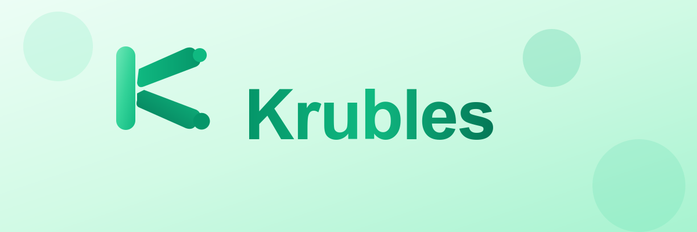

<div align="center">
  
  
  <h1>🚀 Krubles Asset Management</h1>
  <h3>The Modern Way to Track, Manage, and Optimize Any Asset</h3>
  
  <p>
    
    
    
    
  </p>
  
  <p>
    <a href="#-why-krubles">Why Krubles?</a> •
    <a href="#-features">Features</a> •
    <a href="#-who-uses-krubles">Who Uses Krubles</a> •
    <a href="#-get-started">Get Started</a> •
    <a href="#-live-demo">Live Demo</a>
  </p>
</div>

---

## 💡 Why Krubles?

**Stop drowning in spreadsheets.** Krubles is the enterprise-grade asset management platform that scales from startups to Fortune 500s. Whether you're tracking IT equipment, manufacturing tools, fleet vehicles, office furniture, or medical devices—Krubles gives you complete visibility and control.

### The Problem
- 📊 Spreadsheets break at scale
- 🔍 No way to track asset lifecycle
- 👥 No collaboration or access control
- 📈 Zero insights or reporting
- 🔗 Manual data entry and exports

### The Solution
**Krubles** delivers a beautiful, powerful platform that handles:
- ✅ Any asset type (IT, Manufacturing, Fleet, Medical, Office, Equipment)
- ✅ Complete lifecycle tracking (Purchase → Assignment → Maintenance → Disposal)

---

## 🎯 Who Uses Krubles?

<table>
<tr>
<td width="33%" valign="top">

### 🏢 **IT Teams**
Track laptops, servers, licenses, peripherals. Automate onboarding/offboarding. Never lose track of warranty dates.

</td>
<td width="33%" valign="top">

### � **Manufacturing**
Manage tools, machinery, equipment. Schedule maintenance. Track calibration and compliance.

</td>
<td width="33%" valign="top">

### 🚚 **Fleet Management**
Monitor vehicles, trailers, equipment. Track mileage, fuel, maintenance schedules.

</td>
</tr>
<tr>
<td width="33%" valign="top">

### 🏥 **Healthcare**
Medical devices, lab equipment, beds, wheelchairs. Compliance tracking and audit trails.

</td>
<td width="33%" valign="top">

### 🏪 **Retail**
POS systems, displays, signage, furniture. Multi-location inventory management.

</td>
<td width="33%" valign="top">

### � **Education**
Chromebooks, projectors, lab equipment, furniture. Student device assignment tracking.

</td>
</tr>
</table>

---

## ⚡ Features That Set Us Apart

### 🎨 **Modern, Intuitive Interface**
- Beautiful responsive design that works on any device
- Dark mode support
- AI-powered smart asset creation (auto-detects brands, models, warranties)
- Real-time search and filtering

### � **Complete Asset Lifecycle**
- **Purchase** → Track acquisition costs, vendors, POs
- **Assignment** → Assign to users, departments, locations
- **Maintenance** → Schedule preventive maintenance, log repairs
- **Disposal** → Track decommissioning and asset retirement

### 🔐 **Enterprise Security**
- Multi-tenant SaaS architecture with complete tenant isolation
- Role-based access control (5 levels: Super Admin → Viewer)
- JWT authentication with refresh tokens
- Google OAuth 2.0 & Microsoft SSO
- Multi-factor authentication (MFA) support
- GDPR & CCPA compliant
- Audit logging on all changes

### 📊 **Powerful Reporting**
- Real-time dashboards and analytics
- Custom reports by category, location, user, status
- Export to Excel, CSV, PDF with advanced filtering
- Asset depreciation tracking
- Cost center allocation
- Value tracking over time

### 🔗 **11+ Integrations (All Built-In)**
| Integration | Use Case |
|-------------|----------|
| **Stripe** | Subscription billing, payment links, usage-based pricing |
| **Slack** | Real-time asset alerts and maintenance notifications |
| **Google OAuth** | Single Sign-On for Google Workspace |
| **Microsoft OAuth** | Azure AD / Entra ID enterprise SSO |
| **Email** | Alerts, reports, password resets (SendGrid/AWS SES) |
| **Excel** | Generate formatted .xlsx reports with styling |
| **PDF** | Asset labels, reports, invoices |
| **CSV** | Bulk import/export for data migration |
| **Webhooks** | Custom integrations and automation |
| **REST API** | Full programmatic access with OpenAPI docs |
| **API Keys** | Secure programmatic access with rate limiting |

### 🤖 **AI-Powered Intelligence**
- Auto-detects 30+ brands (Apple, Dell, HP, Lenovo, Microsoft, etc.)
- Extracts model numbers from asset names
- Suggests warranty periods based on asset type
- Predicts maintenance schedules
- Smart tagging and categorization
- Rate-limited for reliability (30 requests per 5 minutes)

---

## 🚀 Get Started in 60 Seconds

### Option 1: Docker (Recommended)

```bash
# Clone the repo
git clone https://github.com/C-Elkins/Asset-Management.git
cd it-asset-management

# Start everything with Docker
docker-compose up -d

# Open your browser
open http://localhost:5173
```

**Default Admin Login:**
- Email: `admin@example.com`
- Password: `admin123`

### Option 2: Local Development

```bash
# Backend (Java 21 + Spring Boot)
cd backend
./mvnw spring-boot:run

# Frontend (React 19 + Vite)
cd frontend
npm install && npm run dev
```

📚 **Full setup guide**: [docs/deployment-guide.md](docs/deployment-guide.md)

---

## 🎬 Live Demo & Documentation

🌐 **Try it yourself**: [Schedule a Demo](mailto:demo@krubles.com)

📸 **Screenshots**:

| Dashboard | Asset Details | Reports |
|-----------|---------------|---------|
| _Coming soon_ | _Coming soon_ | _Coming soon_ |

📖 **Documentation**:
- [API Documentation](docs/api-documentation.md)
- [Multi-Tenant Guide](docs/MULTI_TENANT_GUIDE.md)
- [OAuth Setup](docs/oauth-implementation-guide.md)
- [Deployment Guide](docs/deployment-guide.md)
- [Stripe Integration](README_STRIPE.md)
- [Monitoring Setup](MONITORING-SETUP-GUIDE.md)

---

## 🛠️ Technology Stack

**Frontend**
- React 19 + TypeScript
- Vite 7 for blazing-fast builds (< 3s)
- TailwindCSS + Framer Motion
- React Query for server state
- Zustand for client state

**Backend**
- Spring Boot 3.4.1 + Java 21
- PostgreSQL 15 with Flyway migrations
- Spring Security + JWT + OAuth2
- RESTful API with OpenAPI docs
- Micrometer for metrics

**DevOps**
- Docker + Docker Compose
- GitHub Actions CI/CD
- Prometheus + Grafana monitoring
- Sentry error tracking
- ELK stack for logging

---
- **Flyway** - Database migrations
- **Spring Security** - Authentication & authorization
- **Apache POI** - Excel processing
- **Micrometer** - Metrics & observability

**DevOps**
- **Docker** - Containerization
- **Docker Compose** - Local orchestration
- **GitHub Actions** - CI/CD pipeline
- **Nginx** - Production web server

### Architecture Diagram

```
┌─────────────────────────────────────────────────────────────┐
│                    Frontend (React + Vite)                  │
│  Marketing Pages • Dashboard • Asset Management • Reports   │
└──────────────────────┬──────────────────────────────────────┘
                       │ REST API (JWT Auth)
┌──────────────────────▼──────────────────────────────────────┐
│              Spring Boot Backend (Java 21)                  │
│  Controllers → Services → Repositories → Database           │
│  • AssetService  • WebhookService  • SlackService          │
│  • ExcelService  • ExportService   • ImportService         │
└──────────────────────┬──────────────────────────────────────┘
                       │
┌──────────────────────▼──────────────────────────────────────┐
│                PostgreSQL Database                          │
│  Assets • Categories • Users • Webhooks • Maintenance       │
└─────────────────────────────────────────────────────────────┘
         │                    │                    │
         ▼                    ▼                    ▼
   Webhooks              Slack API          Excel Exports
```

---

## 🚀 Quick Start

### Prerequisites

- **Docker** & **Docker Compose** (recommended)
- OR **Java 21+**, **Node.js 18+**, **PostgreSQL 14+**

### Option 1: Docker Compose (Easiest)

```bash
# Clone the repository
git clone https://github.com/C-Elkins/IT-Asset-Management.git
cd IT-Asset-Management

# Start all services
docker-compose up -d

# Access the application
open http://localhost:3001
```

**Default Credentials**:
- Username: `admin`
- Password: `admin123`

### Option 2: Local Development

#### Backend Setup

```bash
cd backend

# Install dependencies & build
./mvnw clean install

# Run with dev profile
./mvnw spring-boot:run -Dspring-boot.run.profiles=dev
```

Backend will be available at `http://localhost:8080`

#### Frontend Setup

```bash
cd frontend

# Install dependencies
npm install

# Start dev server
npm run dev
```

Frontend will be available at `http://localhost:3001`

---

## 📚 Project Structure

```
IT-Asset-Management/
├── backend/                    # Spring Boot API
│   ├── src/main/java/
│   │   └── com/chaseelkins/assetmanagement/
│   │       ├── config/        # Spring configuration
│   │       ├── controller/    # REST endpoints
│   │       ├── dto/           # Data transfer objects
│   │       ├── model/         # JPA entities
│   │       ├── repository/    # Data access layer
│   │       ├── security/      # Auth & authorization
│   │       └── service/       # Business logic
│   ├── src/main/resources/
│   │   ├── application.yml    # App configuration
│   │   └── db/migration/      # Flyway SQL migrations
│   └── pom.xml               # Maven dependencies
│
├── frontend/                   # React SPA
│   ├── src/
│   │   ├── components/        # Reusable components
│   │   ├── pages/            
│   │   │   ├── auth/         # Login, signup, reset
│   │   │   ├── dashboard/    # Admin dashboard
│   │   │   └── marketing/    # Public pages
│   │   ├── services/         # API clients
│   │   ├── hooks/            # Custom React hooks
│   │   ├── stores/           # State management
│   │   └── utils/            # Helper functions
│   ├── public/               # Static assets
│   └── package.json          # NPM dependencies
│
├── docs/                       # Documentation
│   ├── api-documentation.md   # API reference
│   ├── auth-setup.md          # Authentication guide
│   ├── deployment-guide.md    # Production deployment
│   ├── oauth-implementation-guide.md
│   ├── slack-integration-guide.md
│   └── user-guide.md          # End user docs
│
├── docker-compose.yml         # Full stack orchestration
├── Makefile                   # Common commands
└── README.md                  # This file
```

---

## 🌐 Marketing Pages

Krubles includes **9 beautifully designed marketing pages** built with modern gradients, animations, and responsive design:

1. **Home** (`/`) - Landing page with hero, features, and CTA
2. **Features** (`/features`) - Detailed feature showcase
3. **Solutions** (`/solutions`) - Industry use cases
4. **Pricing** (`/pricing`) - Transparent pricing tiers
5. **Customers** (`/customers`) - Testimonials & success stories
6. **Integrations** (`/integrations`) - Available integrations
7. **Security** (`/security`) - Security & compliance
8. **About** (`/about`) - Company story & team
9. **Contact** (`/contact`) - Get in touch

**Design System**:
- Blue-green gradient (`#2563eb` to `#10b981`)
- Animated gradient blobs
- Smooth scroll animations
- Mobile-responsive (Tailwind breakpoints)
- Consistent typography & spacing

---

## 🔧 Configuration

### Environment Variables

**Backend** (`backend/src/main/resources/application.yml`):

```yaml
# Database
spring.datasource.url=${DATABASE_URL:jdbc:postgresql://localhost:5432/assetdb}

---

## 🌐 Marketing Pages

Krubles includes **9 beautifully designed marketing pages** to showcase your deployment:

1. **Home** (`/`) - Landing page with hero, features, and CTA
2. **Features** (`/features`) - Detailed feature showcase
3. **Solutions** (`/solutions`) - Industry use cases
4. **Pricing** (`/pricing`) - Transparent pricing tiers
5. **Customers** (`/customers`) - Testimonials & success stories
6. **Integrations** (`/integrations`) - Available integrations
7. **Security** (`/security`) - Security & compliance
8. **About** (`/about`) - Company story & team
9. **Contact** (`/contact`) - Get in touch

Built with modern gradients, animations, and fully responsive design.

---

## 🔧 Configuration

### Quick Setup

**Backend Environment** (`backend/src/main/resources/application.yml`):
```yaml
# Minimal required configuration
spring.datasource.url=${DATABASE_URL:jdbc:postgresql://localhost:5432/assetdb}
jwt.secret=${JWT_SECRET:your-secret-key-min-32-chars}
```

**Frontend Environment** (`.env`):
```env
VITE_API_URL=http://localhost:8080/api/v1
VITE_APP_NAME=Krubles Asset Management

# Optional: Enable OAuth
VITE_GOOGLE_CLIENT_ID=your-google-client-id
VITE_MICROSOFT_CLIENT_ID=your-microsoft-client-id
```

📖 **Detailed guides**: [docs/auth-setup.md](docs/auth-setup.md), [docs/OAUTH_SETUP.md](docs/OAUTH_SETUP.md)

---

## 🧪 Testing

```bash
# Backend
cd backend && ./mvnw test

# Frontend
cd frontend && npm test

# End-to-end tests
npm run test:e2e
```

---

## � Production Deployment

```bash
# Build for production
cd backend && ./mvnw clean package
cd frontend && npm run build

# Deploy with Docker
docker-compose -f docker-compose.prod.yml up -d
```

**Deployment Checklist:**
- ✅ Set strong JWT_SECRET (32+ characters)
- ✅ Configure production database
- ✅ Enable HTTPS
- ✅ Set up backups
- ✅ Configure monitoring

� **Full deployment guide**: [docs/deployment-guide.md](docs/deployment-guide.md)

---

## 💰 Pricing

**Self-Hosted:** Free and open source under MIT license. Deploy on your infrastructure.

**SaaS (Coming Soon):**
- **Starter**: $49/month - Up to 500 assets
- **Business**: $199/month - Up to 5,000 assets
- **Enterprise**: Custom pricing - Unlimited assets, dedicated support

📄 Full pricing details: [PRICING_BREAKDOWN.md](PRICING_BREAKDOWN.md)

---

## 🤝 Contributing

We welcome contributions! Whether it's:
- 🐛 Bug reports and fixes
- ✨ Feature requests and implementations
- 📖 Documentation improvements
- 🧪 Test coverage expansion

See [CONTRIBUTING.md](./CONTRIBUTING.md) for guidelines.

---

## 🔒 Security

We take security seriously. If you discover a vulnerability:
- 📧 Email: security@krubles.com
- 🏆 Hall of Fame: [SECURITY_HALL_OF_FAME.md](SECURITY_HALL_OF_FAME.md)

See [SECURITY.md](./SECURITY.md) for our security policy.

---

## 📄 License

MIT License - see [LICENSE](LICENSE) for details.

This means you can:
- ✅ Use commercially
- ✅ Modify and distribute
- ✅ Use privately
- ✅ Patent use

---

## 🎯 Roadmap

Coming soon:
- 🔄 ServiceNow integration
- 🎫 Jira integration
- 🔐 Okta SSO
- 📱 Mobile apps (iOS/Android)
- 🤖 Advanced AI features
- 📊 Power BI connector
- 🌍 i18n (internationalization)

---

## ⭐ Star Us!

If Krubles helps your team, please give us a star on GitHub!

[](https://github.com/C-Elkins/Asset-Management/stargazers)

---

## 📞 Get in Touch

- 🌐 Website: [Coming Soon]
- 📧 Email: hello@krubles.com
- 💬 Schedule a Demo: demo@krubles.com
- 🐦 Twitter: [@KrublesHQ](https://twitter.com/KrublesHQ)
- 💼 LinkedIn: [Krubles](https://linkedin.com/company/krubles)

---

## 📚 Additional Documentation

Detailed guides in the `/docs` folder:

- [API Documentation](docs/api-documentation.md) - Complete REST API reference
- [Multi-Tenant Guide](docs/MULTI_TENANT_GUIDE.md) - SaaS deployment guide
- [OAuth Setup](docs/oauth-implementation-guide.md) - Google/Microsoft SSO
- [Deployment Guide](docs/deployment-guide.md) - Production deployment
- [Stripe Integration](README_STRIPE.md) - Billing setup
- [Monitoring Setup](MONITORING-SETUP-GUIDE.md) - Observability stack
- [Email Integration](docs/email-integration.md) - SMTP configuration
- [Slack Integration](docs/slack-integration-guide.md) - Webhook setup

---

<div align="center">
  <h3>Built with ❤️ by the Krubles team</h3>
  <p><em>Making asset management simple, powerful, and delightful.</em></p>
  
  <p>
    <strong>🚀 Ready to get started?</strong><br>
    <code>git clone https://github.com/C-Elkins/Asset-Management.git && cd it-asset-management && docker-compose up -d</code>
  </p>
</div>

